# Microsoft Word
  
Modulo para trabajar con Microsoft Word  

*Read this in other languages: [English](Manual_MicrosoftWord.md), [Portugues](Manual_MicrosoftWord.pr.md), [Español](Manual_MicrosoftWord.es.md).*
  

## How to install this module
  
__Download__ and __install__ the content in 'modules' folder in Rocketbot path  

## Description of the commands

### New Document
  
Create a new word document
|Parameters|Description|example|
| --- | --- | --- |
|Session|File session|Word1|

### Open Document
  
Open a Word document.
|Parameters|Description|example|
| --- | --- | --- |
|File|Open the specified document|file.docx|
|Session|File session|Word1|

### Read Document
  
Extract text from a Word document
|Parameters|Description|example|
| --- | --- | --- |
|Result|Store the result in a variable|Variable|
|Session|File session|Word1|
|Add Details|Choose if the stored data will be saved with details like style, alignment, etc.|True|

### Copy and paste text
  
Copy and paste text between ranges in a Word document and paste it in another document
|Parameters|Description|example|
| --- | --- | --- |
|Start of range|Position of the range from where the command starts to copy.|0|
|End of range|Position of the range to which the command copies.|40|
|Session of the archive to copy|File session|Word1|
|File|Choose the document where the copied content is pasted.|file.docx|

### Copy text
  
Copy text to clipboard between ranges in a Word document
|Parameters|Description|example|
| --- | --- | --- |
|Start of range|Position of the range from where the command starts to copy.|0|
|End of range|Position of the range to which the command copies.|40|
|Session|File session|Word1|

### Paste text
  
Paste text from clipboard in a Word document
|Parameters|Description|example|
| --- | --- | --- |
|Session|File session|Word1|

### Count characters
  
Count characters in a specific paragraph
|Parameters|Description|example|
| --- | --- | --- |
|Session|File session|Word1|
|Paragraph|Paragraph to count characters|1|
|Result|Store the result in a variable|Variable|

### Add table
  
Add table in a Word document.
|Parameters|Description|example|
| --- | --- | --- |
|Number of rows|Number of rows that the table will have|3 |
|Number of columns|Number of columns that the table will have|4 |
|Table style|Microsoft Word default table style|Colorful Grid|
|Session|File session|Word1|
|Border styles|Table border style. Line type and size.|Line type: Single wavy / Line size: 1 1/2 points|

### Read Tables
  
Extract data from the Tables in the document
|Parameters|Description|example|
| --- | --- | --- |
|Table to read|Table number from which the content will be read|1|
|Session|File session|Word1|
|Result|Store the result in a variable|Variable|

### Edit table
  
Edit table from a Word document.
|Parameters|Description|example|
| --- | --- | --- |
|Table number|Table number to be edited|1|
|Session|File session|Word1|
|Enter the row number to delete|Optional. The row number entered determines which row will be removed from the table.| |
|Enter the column number to delete|Optional. The column number entered determines which column will be removed from the table.| |
|Insert row|If selected, adds a row to the end of the table|True|
|Insert column|If selected, adds a column to the end of the table|False|
|Column Width|Width in points that each column of the table will have|140|
|Row height|Height in points that each row of the table will have|25|

### Save document
  
Extract text from file.
|Parameters|Description|example|
| --- | --- | --- |
|Session|File session|Word1|
|Save file|Save the file to the specified path|file.docx|

### Write in Document
  
Write in a Word document.
|Parameters|Description|example|
| --- | --- | --- |
|Session|File session|Word1|
|Write text|Text to be written on the document|Lorem ipsum |
|Text type|Text type selector that will have the written text.|Subtitle|
|Level|Level that the written text will have.|1-9|
|Font size|Font size that the written text will have.|12|
|Align|Align that the written text will have.|Left|
|Bold|Select whether the text will be bold.|True|
|Italic|Select whether the text will be italic.|True|
|Underline|Select whether the text will be underlined.|False|

### Close Document
  
Close the document that is running
|Parameters|Description|example|
| --- | --- | --- |
|Session|File session|Word1|

### Add Page
  
Add a new page to the document
|Parameters|Description|example|
| --- | --- | --- |
|Session|File session|Word1|

### Add Picture
  
Add an image to the document.
|Parameters|Description|example|
| --- | --- | --- |
|Session|File session|Word1|
|Image path|Image path that will be added below the last paragraph|image.jpg|

### Convert to PDF
  
Convert Word document to PDF.
|Parameters|Description|example|
| --- | --- | --- |
|Session|File session|Word1|
|Save file|Path of the file where the PDF will be created|file.pdf|

### Locate Text in Paragraph
  
Locate in which paragraph there is an indicated text.
|Parameters|Description|example|
| --- | --- | --- |
|Session|File session|Word1|
|Text to Search|Text that will be used to locate the paragraph|Hello Word|
|variable name|Store the result in a variable|Variable|

### Count Paragraphs
  
Count the number of paragraphs in the document. Includes table fields.
|Parameters|Description|example|
| --- | --- | --- |
|Session|File session|Word1|
|variable name|Store the number of paragraphs in a variable|Variable|

### Replace text in paragraph
  
Replace the text of a paragraph.
|Parameters|Description|example|
| --- | --- | --- |
|Session|File session|Word1|
|Text to Search|Text to be searched for in the listed paragraphs.|Hello Word|
|Text to replace|Text to be replaced|Hello Word|
|Paragraph numbers|Paragraphs where the specified text will be searched|Comma separated ',' example: 1,2|

### Delete paragraph
  
Delete paragraph from the document.
|Parameters|Description|example|
| --- | --- | --- |
|Session|File session|Word1|
|Paragraph number|Paragraph number to be deleted|1|
|Variable name where the deleted paragraph will be saved|Variable where the text that included the deleted paragraph will be saved|Variable|

### Add text at the end of bookmark
  
Add text at the end of bookmark.
|Parameters|Description|example|
| --- | --- | --- |
|Session|File session|Word1|
|Text to add|Text that will be added to the chosen bookmark.|Hello Word|
|Bookmark Name|Name of the bookmark where the text will be added.|Bookmark 1|
=======

# Microsoft Word
  
Modulo para trabajar con Microsoft Word  
  

## Como usar este módulo:

Con este módulo tu puedes hacer lo siguiente:

1) Nuevo Documento
2) Abrir Documento
3) Leer Documento
4) Leer Tabla
5) Guardar Documento
6) Escribir en Documento
7) Cerrar Documento
8) Insertar página
9) Agregar imagen
10) Convertir a PDF
11) Buscar texto en párrafo
12) Contar párrafos
13) Reemplazar texto en párrafos
14) Agregar texto  a un marcador
15) Copiar de Excel a Word

## 1- Nuevo documento
Con este comando puedes crear un nuevo documento de word. Este comando no necesita parámetros

## 2- Abrir documento
Con este comando puedes abrir un documento word. Debes indicar la ruta del documento que quieres abrir, incluida la extensión .docx

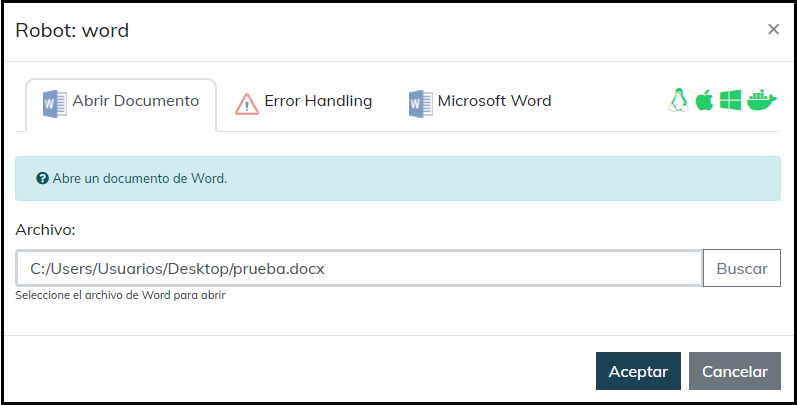

## 3- Leer documento
Este comando extrae texto del documento word. Debes escribir el nombre de la variable donde se guardará el texto y si quieres obtener más información como estilo, detalles del párrafo, etc. Debes marcar la casilla “Agregar detalles”.

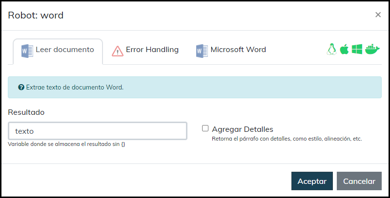

### Resultado
En la variable guardará el texto como una lista, donde cada párrafo es un
elemento de la lista.

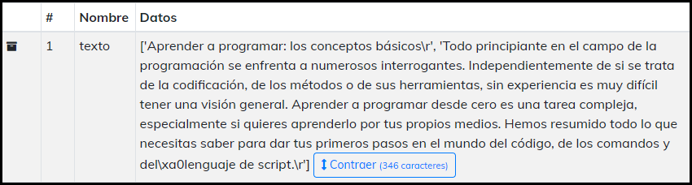

## 4- Leer tabla
Este comando extrae los datos de una tabla. Debes escribir el nombre de la variable donde se guardaran los datos de la tabla.

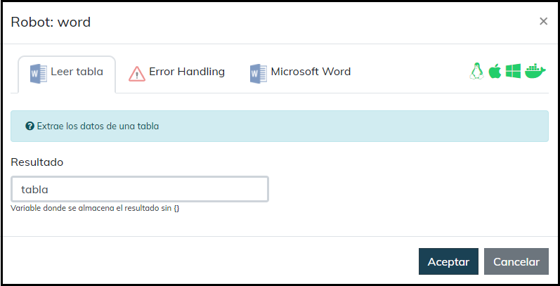

### Resultado
Guarda en una variable una lista donde cada fila es otra lista.

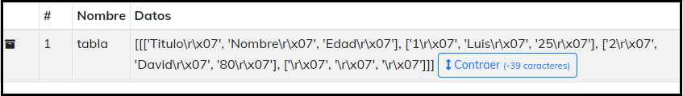

## 5- Guardar documento
Este comando guarda el documento Word abierto. Debes indicar la ruta donde quieres que se guarde, incluida la extensión .docx

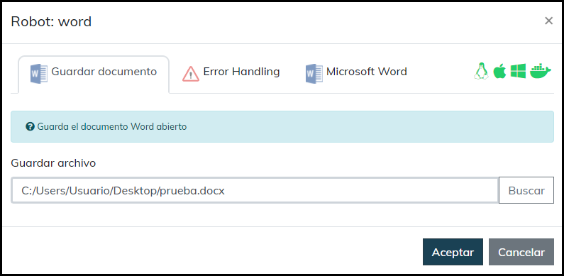

## 6- Escribir en documento
Este comando permite escribir texto en el documento. 
● Escriba texto: Ingrese el texto que quiere escribir en el documento.  
● Tipo de texto: Seleccione el tipo de texto que quiere escribir, por
ejemplo un párrafo, título, viñeta, etc. 
● Nivel: Completar para los tipos de texto que tengan niveles. Por
ejemplo títulos (título 1, título 2, etc), viñetas, etc. 
● Tamaño de fuente: Seleccione el tamaño del texto. 
● Alineación: Seleccione el tipo de alineación del texto, por ejemplo,
derecha, central, etc. 
● Marque las casillas de negrita, cursiva y subrayar, según lo que
necesite.

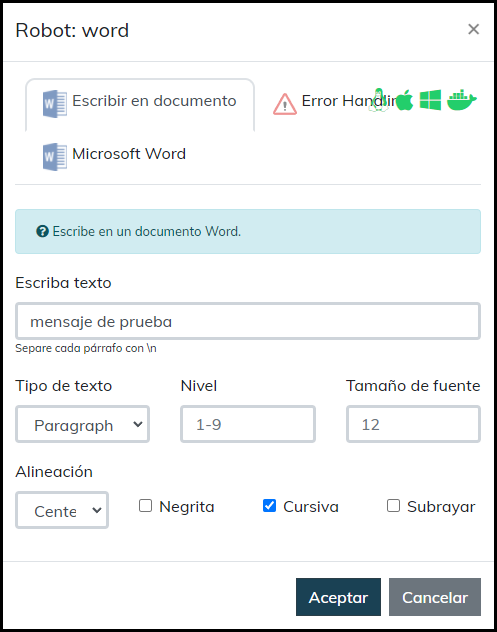

## 7- . Cerrar documento
Este comando cierra el documento que se está ejecutando. Es importante que antes de utilizar este comando, utilices el comando de guardar documento.

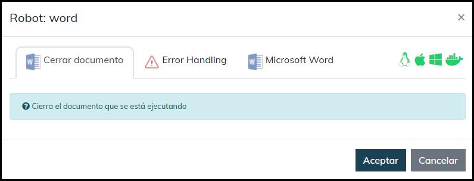

## 8- Insertar página
Este comando inserta una nueva página al documento que se está ejecutando.

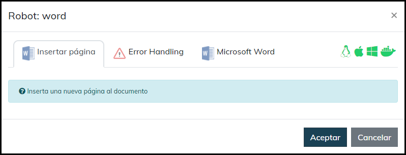

## 9-  Agregar imagen
Este comando agrega una imagen al documento. Debes indicar la ruta de la imagen que quieres agregar, incluida la extensión .jpg

## 10-  Convertir a PDF
Este comando convierte un documento Word en PDF. Si es el documento que ya está abierto dejar el campo “Archivo Word” dejar el campo vacío. En el camp “Guardar Archivo” debes seleccionar el lugar donde quieras guardar el PDF con su nombre y la extensión .pdf

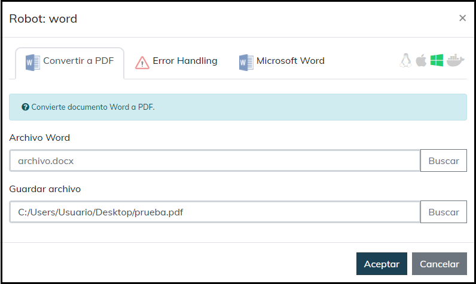

## 11- Buscar texto en párrafo
Este comando busca el párrafo donde se encuentra el texto indicado a buscar, Debes escribir el nombre de la variable donde se guardaran los datos.

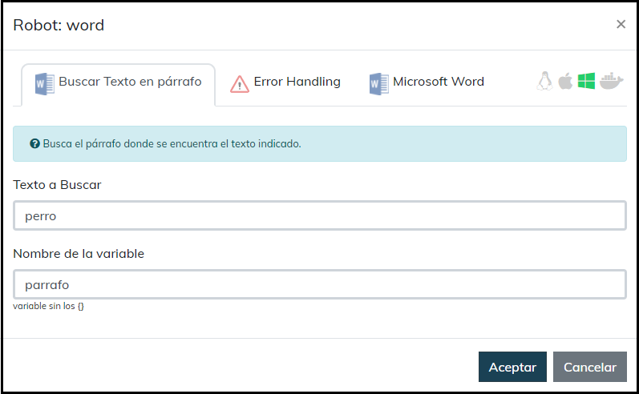

### Resultado
Guardará en la variable la línea en donde se encuentre la palabra a buscar.

## 12- Contar párrafos
Este comando cuenta la cantidad de párrafos del documento, debes escribir el nombre de la variable donde se guardaran los datos

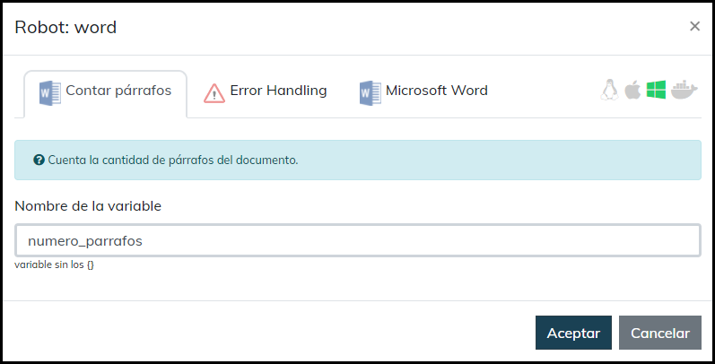

## 13- Reemplazar texto en párrafo
Reemplaza un texto en el documento en el párrafo indicado.  
● En Texto a buscar debes colocar la palabra que quieres reemplazar. 
● En Texto a reemplazar ira la palabra que reemplaza el texto a buscar. 
● En Lista de párrafo es la posición del párrafo donde se encuentra el texto que quieres reemplazar

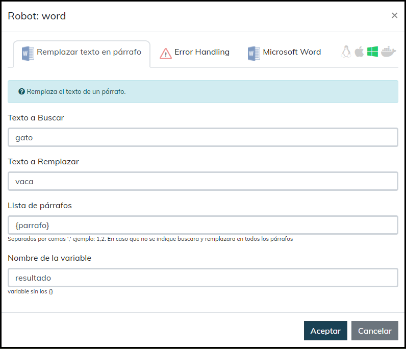

## 14- Agregar texto a un marcador
Este comando agrega texto a un marcador de Microsoft Word. Debes escribir el nombre del marcador en
el comando exactamente igual a como está guardado en Microsoft Word.

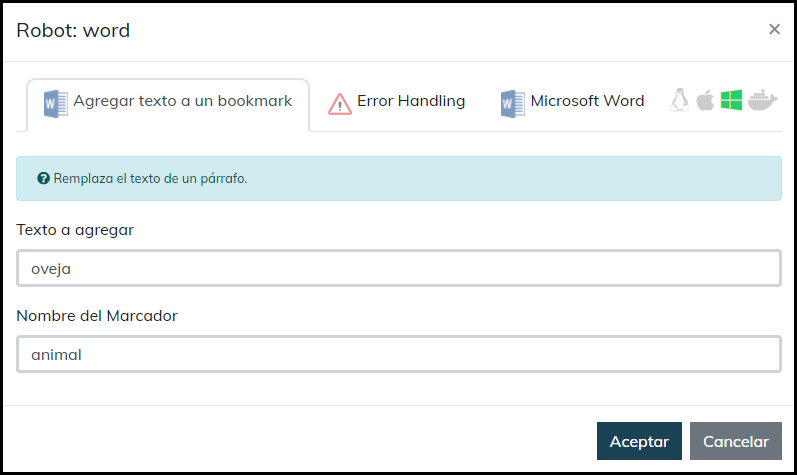

## 15- Copiar de Excel a Word
Con este comando puedes copiar contenido de un archivo Excel y pegarlo en un documento Word, especificando el rango donde se encuentra el contenido que se quiere copiar del archivo Excel y el parrafo donde se va a pegar en el archivo Word, si no se especifica el parrafo por defecto el contenido copiado sera pegado al final del documento

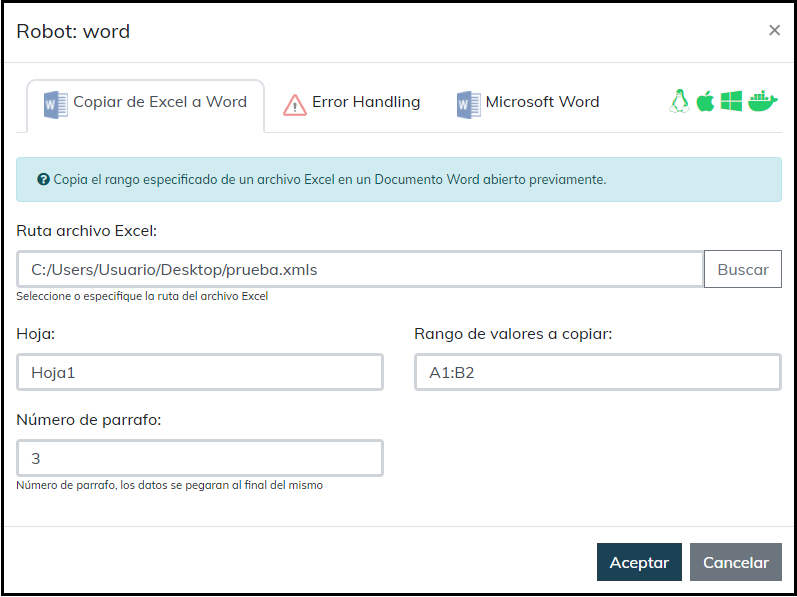
 
## Como instalar este módulo
  
__Descarga__ e __instala__ el contenido en la carpeta 'modules' en la ruta de rocketbot.  

## Descripción de los comandos

### Nuevo documento
  
Crea un nuevo documento word
|Parámetros|Descripción|ejemplo|
| --- | --- | --- |

### Abrir Documento
  
Abre un documento de Word.
|Parámetros|Descripción|ejemplo|
| --- | --- | --- |
|Archivo|Abre el documento especificado|archivo.docx|

### Leer documento
  
Extrae texto de documento Word.
|Parámetros|Descripción|ejemplo|
| --- | --- | --- |
|Resultado|Almacena el resultado en una variable|Variable|
|Agregar Detalles|Agrega informacion del estilo del parrafo||

### Leer tabla
  
Extrae los datos de una tabla
|Parámetros|Descripción|ejemplo|
| --- | --- | --- |
|Resultado|Almacena el resultado en una variable|Variable|

### Guardar documento
  
Guarda el documento Word abierto
|Parámetros|Descripción|ejemplo|
| --- | --- | --- |
|Guardar archivo|Guarda el archivo en la ruta especificada|archivo.docx|

### Escribir en documento
  
Escribe en un documento Word.
|Parámetros|Descripción|ejemplo|
| --- | --- | --- |
|Escriba texto|Texto que se escribira en el documento|Lorem ipsum |
|Tipo de texto|Selector del tipo de texto||
|Nivel||1-9|
|Tamaño de fuente||12|
|Alineación|||
|Negrita|||
|Cursiva|||
|Subrayar|||

### Cerrar documento
  
Cierra el documento que se está ejecutando
|Parámetros|Descripción|ejemplo|
| --- | --- | --- |

### Insertar página
  
Inserta una nueva página al documento
|Parámetros|Descripción|ejemplo|
| --- | --- | --- |

### Agregar imagen
  
Agrega una imagen al documento
|Parámetros|Descripción|ejemplo|
| --- | --- | --- |
|Ruta de la imagen|Ruta de imagen que sera agregada debajo del ultimo parrafo|imagen.jpg|

### Convertir a PDF
  
Convierte documento Word a PDF.
|Parámetros|Descripción|ejemplo|
| --- | --- | --- |
|Archivo Word||archivo.docx|
|Guardar archivo||archivo.pdf|

### Buscar Texto en párrafo
  
Busca el párrafo donde se encuentra el texto indicado.
|Parámetros|Descripción|ejemplo|
| --- | --- | --- |
|Texto a Buscar|Texto que sera usado para localizar el parrafo|Hola mundo|
|Nombre de la variable|Almacena el resultado en una variable|Varible|

### Contar párrafos
  
Cuenta la cantidad de párrafos del documento.
|Parámetros|Descripción|ejemplo|
| --- | --- | --- |
|Nombre de la variable|Almacena el resultado en una variable|Varible|

### Remplazar texto en párrafo
  
Remplaza el texto de un párrafo.
|Parámetros|Descripción|ejemplo|
| --- | --- | --- |
|Texto a Buscar|Texto que sera reemplazado|Hola mundo|
|Texto a Remplazar|Texto que reemplazara el anterior|Hola mundo|
|Lista de párrafos|Parrafos donde buscara el texto especificado|Separados por comas ',' ejemplo: 1,2|
|Nombre de la variable|Almacena el resultado en una variable|Varible|

### Agregar texto a un bookmark
  
Remplaza el texto de un párrafo.
|Parámetros|Descripción|ejemplo|
| --- | --- | --- |
|Texto a agregar||Hola mundo|
|Nombre del Marcador||Marcador 1|

### Copiar de Excel a Word
  
Copia el rango especificado de un archivo Excel en un Documento Word abierto previamente.
|Parámetros|Descripción|ejemplo|
| --- | --- | --- |
|Ruta archivo Excel|Ruta del archivo excel desde el que se copiaran los datos|archivo.xlsx|
|Hoja|Hoja del archivo Excel donde se encuentran los datos|Hoja1|
|Rango de valores a copiar|Rango donde se encuentran los valores que seran pegados en el archivo Word|A1:B2|
|Número de parrafo|Numero del parrafo donde se pegara el contenido del rango copiado|3|

